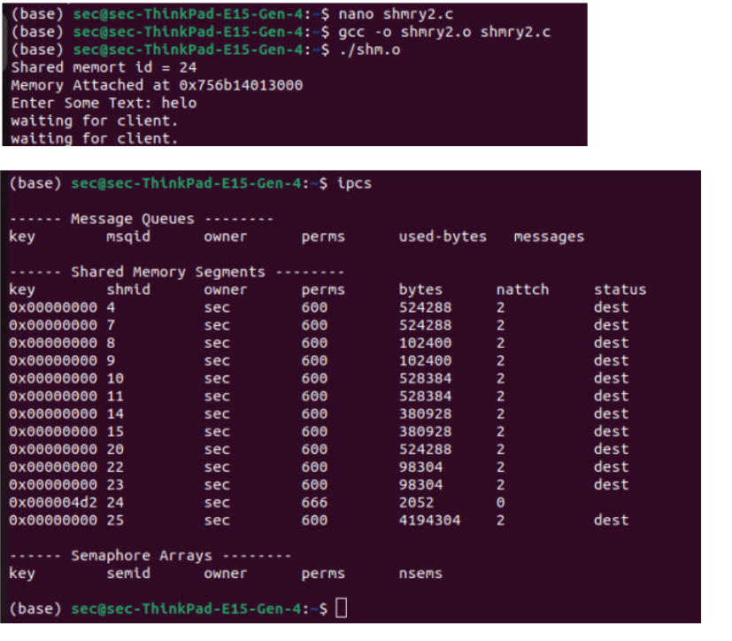

# Linux-IPC-Shared-memory
Ex06-Linux IPC-Shared-memory

# AIM:
To Write a C program that illustrates two processes communicating using shared memory.

# DESIGN STEPS:

### Step 1:

Navigate to any Linux environment installed on the system or installed inside a virtual environment like virtual box/vmware or online linux JSLinux (https://bellard.org/jslinux/vm.html?url=alpine-x86.cfg&mem=192) or docker.

### Step 2:

Write the C Program using Linux Process API - Shared Memory

### Step 3:

Execute the C Program for the desired output. 

# PROGRAM:


## Write a C program that illustrates two processes communicating using shared memory.
```

#include <stdio.h>
#include <sys/ipc.h>
#include <sys/shm.h>

int main()
{
	// Generate a unique key using ftok
	key_t key = ftok("shmfile", 65);

	// Get an identifier for the shared memory segment using shmget
	int shmid = shmget(key, 1024, 0666 | IPC_CREAT);
      printf("Shared memory id = %d \n",shmid);
// Attach to the shared memory segment using shmat
	char* str = (char*)shmat(shmid, (void*)0, 0);
	
    printf("Write Data : ");
	fgets(str, 1024, stdin);

	printf("Data written in memory: %s\n", str);

	// Detach from the shared memory segment using shmdt
	shmdt(str);

	return 0;
}#include <stdio.h>
#include <sys/ipc.h>
#include <sys/shm.h>

int main()
{
	// Generate a unique key using ftok
	key_t key = ftok("shmfile", 65);

	// Get an identifier for the shared memory segment using shmget
	int shmid = shmget(key, 1024, 0666 | IPC_CREAT);
      printf("Shared memory id = %d \n",shmid);
// Attach to the shared memory segment using shmat
	char* str = (char*)shmat(shmid, (void*)0, 0);
	
    printf("Write Data : ");
	fgets(str, 1024, stdin);

	printf("Data written in memory: %s\n", str);

	// Detach from the shared memory segment using shmdt
	shmdt(str);

	return 0;
}
```
#include<unistd.h> 
#include<stdlib.h> 
#include<stdio.h> 
#include<string.h>
#include<sys/shm.h>
#define TEXT_SZ 2048 
struct shared_use_st{
int written_by_you;
char some_text[TEXT_SZ];
};
int main()
{
int running =1;
void *shared_memory = (void *)0; 
struct shared_use_st *shared_stuff; 
char buffer[BUFSIZ];
int shmid;
shmid	=shmget(	(key_t)1234,	sizeof(struct shared_use_st), 0666 | IPC_CREAT);
printf("Shared memory id = %d \n",shmid);
if (shmid == -1)
{
fprintf(stderr, "shmget failed\n"); exit(EXIT_FAILURE);
}
shared_memory=shmat(shmid, (void *)0, 0);
if (shared_memory == (void *)-1){
fprintf(stderr,	"shmat	failed\n"); exit(EXIT_FAILURE);}
printf("Memory Attached at %x\n", (int) shared_memory); 
shared_stuff = (struct shared_use_st *)shared_memory; 
while(running)
{
while(shared_stuff->written_by_you== 1)
{
sleep(1);
printf("waiting for client.	\n");
}
printf("Enter Some Text: "); fgets (buffer, BUFSIZ, stdin);
strncpy(shared_stuff->some_text, buffer, TEXT_SZ);
shared_stuff->written_by_you = 1;
if(strncmp(buffer, "end", 3) == 0){
running = 0;}}
if (shmdt(shared_memory) == -1)
{
fprintf(stderr, "shmdt failed\n"); exit(EXIT_FAILURE);
} exit(EXIT_SUCCESS);
}


## OUTPUT



# RESULT:
The program is executed successfully.
